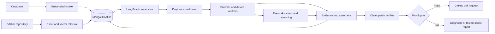

# Tracecase

## [Open the live product](https://tracecase.vercel.app)

**Tracecase turns incomplete customer bug reports into evidence-backed reproductions and tested GitHub pull requests.**

A customer can report a problem without knowing how to write a technical ticket. Tracecase asks the missing questions, reads the connected repository, tests the reported behavior across isolated browser and device environments, and records what actually happened. If it proves the failure and verifies a safe fix, it prepares a pull request. If it cannot prove the failure or the fix, it stops and reports the tested scope and remaining unknowns.

Tracecase uses **MongoDB Atlas as its operational memory**, **LangGraph for durable agent orchestration**, **Fireworks for structured reasoning and vision**, **Daytona for isolated execution**, **BrowserStack for genuine Windows, macOS, Android, and iOS sessions**, and a **GitHub App for repository access and pull requests**.

> Tracecase is a hackathon prototype. The repository contains the complete product path and its safety gates. The [Current status](#current-status) section distinguishes verified behavior from work that still needs a full production run.

## The problem

The first bug report often contains one sentence:

> “The publish button gets stuck.”

That sentence does not tell an engineer which release, browser, operating system, account state, feature flag, network condition, or sequence of actions caused the failure. Support has the customer conversation. Observability tools have logs and traces. Browser testing tools have environments. Coding agents have the repository. Engineers still have to connect those systems, reproduce the failure, and decide whether a proposed change is safe.

Tracecase closes that gap. It does not assume that every complaint is a confirmed bug, and it does not mark model output as evidence. It performs the investigation and returns one of three honest outcomes:

1. **Verified fix** — the failure reproduced, a regression test failed on the original commit, the test passed after the patch, the application was checked again, and a pull request is ready.
2. **Diagnosis only** — the failure reproduced, but Tracecase could not prove a safe fix.
3. **Not reproduced within tested scope** — the tested environments and remaining unknowns are preserved for an engineer.

## What the product does

### 1. Collects a useful report

The reporter is an isolated widget that can be embedded on a product website. It collects the observed behavior, expected behavior, frequency, page, and consented browser details. A reporter can type, use the browser's voice input, or attach screenshots and small diagnostic files.

The intake agent uses Fireworks and relevant repository context to ask at most three short follow-up questions. If the model is unavailable, a deterministic fallback keeps the form usable. Drafts are saved in MongoDB. If a reporter leaves, a protected scheduled task continues after 24 hours and records unanswered facts as unknown instead of inventing answers.

The reporter cannot open the private engineering dashboard. Its public project key grants no read access, and its session is signed and restricted to an allowed host origin.

### 2. Understands the repository before testing

The GitHub App gives Tracecase installation-scoped access to the selected repository. Tracecase works from a pinned commit and indexes useful code, routes, tests, dependency files, ownership files, and recent context.

Known identifiers such as a path, symbol, commit, route, or error signature use normal indexed MongoDB queries. Semantic questions use Atlas Vector Search over repository chunks and prior operational memory. Exact facts are never replaced with approximate vector matches.

### 3. Chooses the right investigation breadth

Tracecase assigns one deterministic context class:

| Class | Available context | Investigation strategy |
| --- | --- | --- |
| **A** | Replay, exact environment, release, and user state | Reconstruct the known incident with a small control run. |
| **B** | Some incident-specific evidence | Hold known facts constant and vary only important unknowns. |
| **C** | No replay, cookies, or authenticated state | Use the report and repository to form bounded hypotheses across diverse environments. |

Class C is the hardest and most visual demonstration. Tracecase must search without pretending it knows the customer's hidden state. It labels every missing fact and limits the number, duration, and variation of workers.

### 4. Runs the investigation

LangGraph controls the investigation as a state graph with explicit nodes for classification, retrieval, planning, execution, reproduction, repair, verification, and review. MongoDB checkpoints each durable step. Leases and idempotency keys prevent a retry from opening duplicate pull requests or repeating completed side effects.

Daytona creates an isolated coordinator from the pinned repository. The coordinator creates a bounded browser plan and executes workers in parallel. Linux browser work runs in disposable Daytona sandboxes. When BrowserStack is enabled, Tracecase also uses genuine cloud Windows and macOS sessions and physical Android and iOS devices; it does not relabel Linux browser emulation as a real operating system.

Each worker records its environment, actions, assertions, console output, network activity, screenshots, and duration. The dashboard presents stable worker tiles and signed, masked browser frames while a run is active. BrowserStack can also provide completed session video.

### 5. Uses vision as supporting evidence

Fireworks receives a bounded set of reporter and worker screenshots. It identifies visible loading states, error messages, layout failures, and differences between environments. The model does not decide whether a bug is proven. A failed observable assertion is required for reproduction.

### 6. Verifies the fix before GitHub changes

If the failure reproduces, the fix agent proposes the smallest plausible change and a regression test. A separate clean Daytona verifier checks the original and patched states. Tracecase can create a branch and pull request only when all of these conditions are true:

- The customer failure was reproduced.
- The regression test failed on the unchanged base commit.
- The same test passed with the patch.
- Relevant tests passed.
- The application check passed in a comparable environment.
- The changed files passed the repository and secret safety filters.

By default, Tracecase creates a draft pull request for human review. Merge and deployment paths exist behind explicit project policy and are disabled by default.

## Why MongoDB is core

MongoDB is not a secondary log store in Tracecase. It is the shared memory that lets several agents and external workers act on one case without losing provenance.

| MongoDB capability | How Tracecase uses it |
| --- | --- |
| **Document model** | Stores reports, canonical cases, runs, workers, hypotheses, evidence, patches, and audit records without flattening their different shapes. |
| **Compound indexes** | Resolves tenant, project, case, run, route, commit, path, symbol, and error identifiers exactly. |
| **Atlas Vector Search** | Retrieves related code, runbooks, prior reports, and decisions when an exact identifier is not available. |
| **Automated Embeddings** | The included Atlas index definitions embed code with `voyage-code-3` and operational memory with `voyage-4`. |
| **Durable checkpoints and leases** | Resumes interrupted LangGraph work and prevents duplicate external actions. |
| **Evidence persistence** | Stores redacted evidence metadata, bounded artifact content, hashes, retention dates, and the assertion that each conclusion depends on. |
| **Tenant isolation** | Every project record and search path is scoped by organization and project identifiers. |

The main collections are `reports`, `cases`, `runs`, `run_events`, `evidence_bundles`, `run_checkpoints`, `run_leases`, `repository_chunks`, `knowledge`, `artifacts`, and `audit_events`. Collection validators, indexes, TTL policies, and Atlas Search index definitions are in [mongodb.ts](product/lib/tracecase/mongodb.ts).

## Agent architecture



The main agent roles are:

- **Intake agent** — asks only questions that can change the reproduction plan.
- **Supervisor** — classifies context, applies budgets, checkpoints work, and preserves unknowns.
- **Planner** — converts the report and repository context into executable hypotheses.
- **Browser workers** — perform actions and collect observable evidence in isolated environments.
- **Vision analyst** — compares screenshots without treating visual inference as proof.
- **Fix agent** — proposes a minimal code change and regression test.
- **Verifier** — tests the base and patch in a clean sandbox.
- **Review agent** — creates the GitHub handoff only after the proof gate passes.

## A clear live demo

The intended two-minute Class C demo starts with no customer cookies, replay, or known device state:

1. A customer opens the embedded Tracecase reporter, describes a visible bug, and submits it.
2. The dashboard creates a case, marks it **Class C**, and shows the missing facts.
3. Several environment tiles begin work at the same time. The audience can see the active page, action, environment, and status for each worker.
4. One environment fails the expected-behavior assertion. Tracecase shows the exact steps, screenshot, console or network evidence, and affected environment.
5. The agent identifies the relevant repository files and proposes a small regression test and patch.
6. The review page shows **base failed**, **patch passed**, the code diff, and the resulting GitHub pull request. If proof is incomplete, the demo ends at diagnosis and makes that limitation visible.

This makes the user, action, and result visible within minutes: **a customer reports a problem; agents reproduce and test it; engineering receives evidence and a reviewable change.**

## Technology stack

| Technology | Role in Tracecase |
| --- | --- |
| **MongoDB Atlas** | Operational memory, exact retrieval, Vector Search, Automated Embeddings, artifacts, checkpoints, and audit trail. |
| **LangGraph** | Typed, durable investigation and completion workflows with conditional gates. |
| **Fireworks AI** | Structured intake questions, investigation planning, multimodal screenshot analysis, diagnosis, and constrained patch proposals. |
| **Daytona** | Disposable coordinator and verifier sandboxes with pinned code, time limits, scoped secrets, and network allowlists. |
| **BrowserStack** | Genuine Windows, macOS, physical Android, and physical iOS browser sessions. |
| **GitHub App** | Short-lived installation tokens, repository context, webhooks, branches, commits, and pull requests. |
| **Next.js 16 + React 19** | Private engineering dashboard, public intake, API routes, and Vercel deployment. |
| **Playwright** | Browser actions, assertions, screenshots, console events, and network evidence. |
| **MCP** | Authenticated tools to list cases, inspect runs, and start an investigation from another agent client. |

Optional adapters support OpenTelemetry, Sentry, and Jira. They improve context but are not required for the core investigation path. Voice uses the browser's speech APIs; no voice provider is presented as an integration.

## Creativity and long-term impact

Tracecase is not another tool that reads a stack trace and writes code. Its main innovation is the missing middle between a customer's incomplete complaint and a coding agent:

- It begins at the customer-facing intake, not at an already-clean engineering issue.
- It treats reproduction as a search problem across unknown environment and state variables.
- It shows several agents doing visible work in real environments.
- It combines repository context, visual evidence, browser telemetry, and prior decisions in one MongoDB-backed case.
- It requires executable proof before it can call a patch verified.
- It preserves uncertainty when the customer's state cannot be reconstructed.

The long-term product can reduce the manual handoff among support, QA, and engineering teams. It can also build a reusable memory of which configurations caused previous failures, which attempted fixes failed, and which evidence was strong enough to justify a change. That memory improves future investigations without hiding the source of a decision.

## How the project addresses the judging criteria

| Criterion | Evidence in this project |
| --- | --- |
| **Impact Potential — 20%** | Tracecase addresses the recurring and expensive gap between customer reports and reproducible engineering work. Its output fits the existing GitHub review process and remains useful even when it cannot produce a fix. |
| **Live Demo — 20%** | The product is designed around a visible end-to-end action: report, parallel environment search, reproduction evidence, regression proof, code diff, and pull request. |
| **Technologies Used — 25%** | MongoDB Atlas is the source of operational truth and powers exact plus semantic retrieval. LangGraph, Fireworks, Daytona, BrowserStack, GitHub, and Playwright each perform a distinct part of the real workflow. |
| **Creativity and Originality — 35%** | Tracecase starts before conventional coding agents: it turns an ambiguous customer complaint into an evidence-backed experiment, searches real environments, and refuses to equate generated code with a verified fix. |

## Current status

The following statements are intentionally precise:

### Verified

- The local automated suite passes **26 of 26 tests**.
- TypeScript type checking passes.
- MongoDB Atlas connectivity has been validated.
- GitHub App authentication, installation access, repository permissions, and signed webhook delivery have been validated.
- BrowserStack credentials have launched and captured screenshots from Windows 11 with Chrome, macOS Sequoia with Safari, a physical Google Pixel 7 Pro, and a physical iPhone 16 Pro.
- The code implements reporter uploads, Fireworks-generated follow-ups with a deterministic fallback, durable 24-hour intake continuation, genuine-platform planning, signed live frames, Fireworks vision input, proof-gated GitHub pull requests, team roles, and an authenticated MCP endpoint.

### Still needs end-to-end production validation

- One public Vercel run has not yet been demonstrated from reporter submission through Daytona, all selected BrowserStack workers, Fireworks analysis, clean verification, and an agent-created pull request as a single uninterrupted workflow.
- The dashboard frame feed is a near-live sequence of signed screenshots, not high-frame-rate WebRTC video. BrowserStack session video is available after a session completes.
- Automatic merge and deployment are policy-gated, disabled by default, and are not part of the required demonstration.
- Optional Sentry, Jira, and OpenTelemetry adapters require each deploying organization to supply its own connection.

## Run locally

Requirements: Node.js 22.13 or later, a MongoDB Atlas deployment, and the provider credentials for the integrations you want to exercise.

```powershell
cd product
Copy-Item .env.example .env.local
npm ci
npm run typecheck
npm run test:unit
```

After completing the environment file, prepare MongoDB and start the app:

```powershell
npm run mongo:plan
$env:MONGODB_APPLY_CHANGES='true'
npm run mongo:apply
npm run project:bootstrap
npm run dev
```

See [ENV_SETUP.md](product/ENV_SETUP.md) for provider setup, GitHub App permissions, Vercel variables, secret handling, and the first disposable-repository test.

## Embed the reporter

```html
<script src="https://tracecase.vercel.app/tracecase-widget.js" defer></script>
<tracecase-widget
  base-url="https://tracecase.vercel.app"
  project-key="YOUR_PUBLIC_PROJECT_KEY">
</tracecase-widget>
```

The public project key identifies the project but grants no dashboard or repository access. The dashboard is authenticated separately with GitHub.

## Repository map

```text
product/
  app/intake/                 public reporter interface
  app/app/                    private engineering dashboard
  app/api/                    intake, runs, callbacks, integrations, MCP
  lib/tracecase/              domain, MongoDB, agents, security, execution
  worker/                     remote coordinator, browser worker, verifier
  tests/                      domain, orchestration, persistence, proof gates
  scripts/                    MongoDB, environment, and project setup
specs/tracecase/              requirements, design, and implementation record
```

The deeper product requirements and correctness rules are in [requirements.md](specs/tracecase/requirements.md). The implementation architecture is in [design.md](specs/tracecase/design.md).
